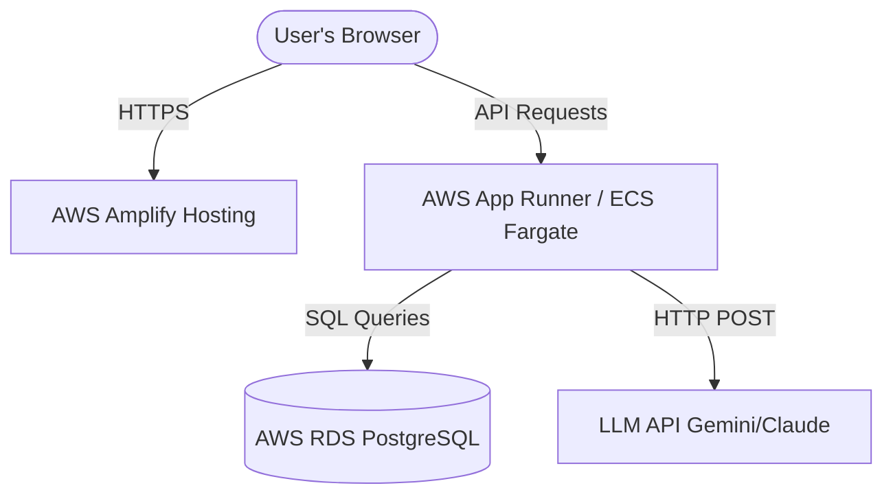

# AWS Deployment Guide for Cogni

This guide provides instructions for deploying both the frontend and backend of the **Cogni** application to AWS.



---

## 1. Database Setup (AWS RDS PostgreSQL)

We recommend using **Amazon RDS PostgreSQL** (or Amazon Aurora Serverless V2) as the relational database.

1. **Create an RDS Instance**:
   - Engine: PostgreSQL (15+ recommended)
   - DB Instance Class: `db.t4g.micro` (sufficient for testing/development) or larger.
   - Credentials: Set your master username and password.
   - Public Access: Select **No** (best security practice; keep it in a private subnet, accessible only by your backend via VPC security groups).

2. **Initialize Schema & Sample Data**:
   - From a Bastion host or an allowed IP (configured temporarily in the RDS Security Group), run the `sample_schema.sql` script:
     ```bash
     psql -h <rds-endpoint-dns> -U <username> -d <db-name> -f backend/sample_schema.sql
     ```

---

## 2. Backend Deployment (AWS App Runner or ECS Fargate)

The backend is fully containerized and ready to be built. We recommend **AWS App Runner** for simplicity, or **AWS ECS Fargate** for more advanced control.

### Option A: AWS App Runner (Recommended for Simplicity)
AWS App Runner can build your container automatically from your repository or pull an image from Amazon ECR.

1. **Deploy from Source (Automatic Build)**:
   - Connect your GitHub repository to AWS App Runner.
   - Choose **Container image** or **Source code repository**. (If source, set the build runtime to `Python 3` and build commands, or point it to the Dockerfile).
   - For Dockerfile deployments:
     - **Deployment trigger**: Automatic or Manual.
     - **Runtime**: Select **Docker**.
     - **Dockerfile path**: `backend/Dockerfile`.
     - **Port**: `8000`.

2. **Environment Variables**:
   Configure the following variables in the App Runner Service Settings:
   - `DATABASE_URL`: `postgresql+psycopg://<username>:<password>@<rds-endpoint>:5432/<db-name>`
   - `GEMINI_API_KEY` or `ANTHROPIC_API_KEY`: API Key for LLM SQL generation.
   - `ALLOWED_ORIGINS`: Comma-separated allowed CORS origins (e.g. `https://main.xxxxxxxx.amplifyapp.com` or custom frontend domain).
   - `BYPASS_DNS_TIMEOUTS`: Set to `false` (default) for AWS (only set `true` for local development if experiencing DNS resolution issues).

---

## 3. Frontend Deployment (AWS Amplify)

We deploy the Vite + React frontend via **AWS Amplify Hosting**. The monorepo configurations have already been set up in `amplify.yml` at the repository root.

1. **Connect Repository in Amplify**:
   - Go to AWS Console → **AWS Amplify** → **New App** → **Host web app**.
   - Connect your GitHub/GitLab repository.
   - Select the branch to build.

2. **Monorepo Settings**:
   - Check the **My app is a monorepo** box.
   - Set the monorepo directory / folder name to `frontend`.

3. **Build Settings**:
   - Amplify will automatically detect the `amplify.yml` file at the root of the repository. It will use the configuration defined in it, which compiles the frontend app in the `frontend` folder and targets the `frontend/dist` directory for hosting.

4. **Environment Variables (Important)**:
   - Add the following environment variable in the Amplify console settings under **App settings > Environment variables**:
     - `VITE_API_URL`: Set this to your AWS App Runner or ECS endpoint URL (e.g. `https://xxxxxx.us-east-1.awsapprunner.com`). Do not append a trailing slash.
     - `AMPLIFY_MONOREPO_APP_ROOT`: `frontend` (tells Amplify to build from the frontend folder).

5. **Deploy**:
   - Save and deploy. Once built, Amplify will serve your React app on a secure HTTPS domain.

---

## 4. Verification

After both deployments succeed:
1. Load the Amplify frontend URL in your browser.
2. Verify that `/health` and `/schema` endpoints load successfully from the console network requests.
3. Submit a query to convert natural language questions to SQL and run database analytics.
